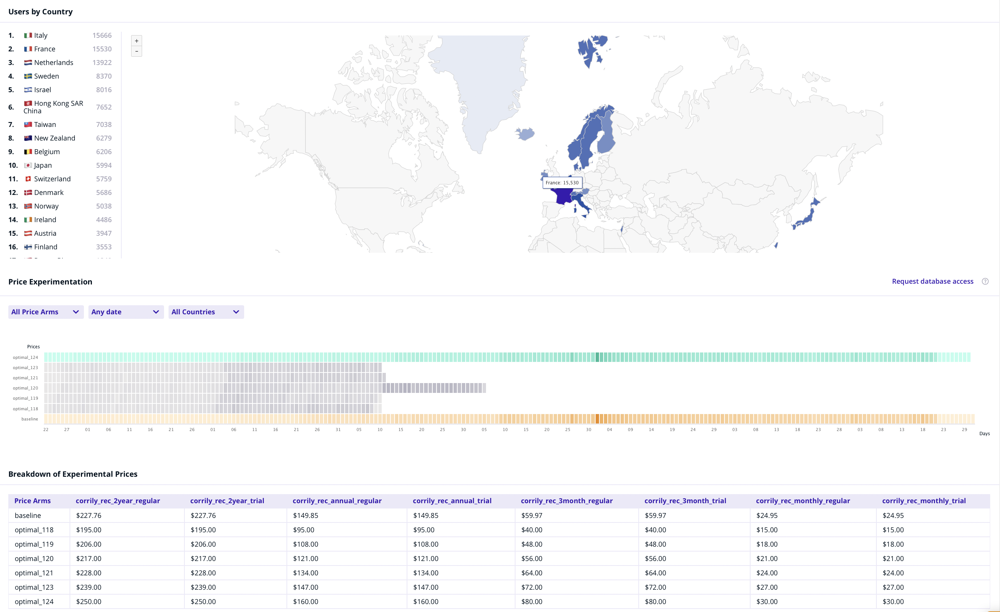
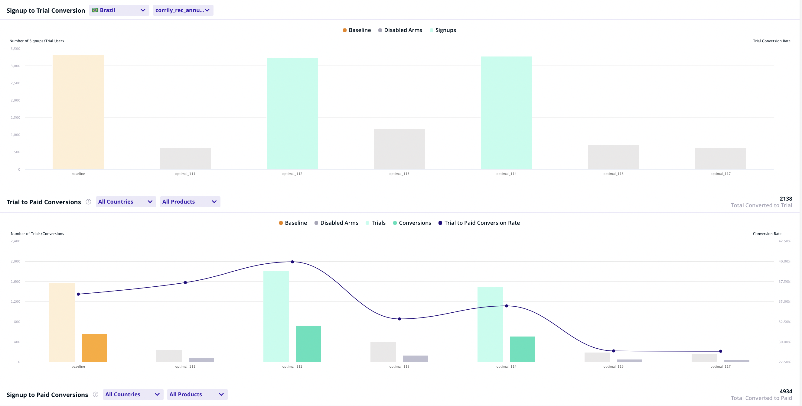
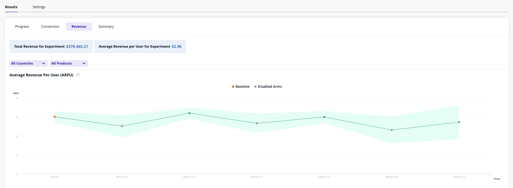
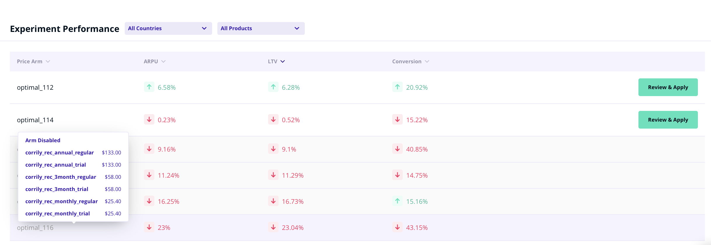

Corrily's Experimentation Platform supports fully self-serve analytics on the dashboard. For all kinds of experiments,
we provide the following analytics charts out of the box. Custom metrics can easily be added depending on your business
needs. Depending on your business model, some of these analytics charts may not apply to you. Corrily only shows charts
which are relevant to your business model.

* **A summary of key metrics** at the experiment level for a quick sanity check (across both control and experiment treatment groups)
    * Number of visitors, users and paying users in the experiment
    * What countries are the visitors coming in from
    * Total Revenue, Average Revenue per user and Conversion Rate
    * Breakdown of each treatment group - i.e. what products and prices are included across each arm in a pricing experiment etc.
    * Which experiment treatment is *active* v/s *disabled*

___

* **Conversion Analytics** across each experiment treatment:
    * Number of sign-ups
    * Free to trial conversion
    * Trial to paid conversion
    * Direct to paid conversion

___

* **Revenue Analytics** across each experiment treatment:
    * Average Revenue Per User, and Avergae Revenue Per Paid User
    * LTV per user, as well per paid user
    * MRR

___

As the experiment approaches convergence, Corrily's models grow more certain about winning treatment(s). **At the end of
an experiment**, you can compare key metrics such as ARPU, LTV, MRR, Conversion Ratio across each treatment, the trade-off
involved (for e.g. ARPU increased by 10% but conversion dropped by 5%), as well as push the changes across specific countries
or audiences and for specific cohorts of user (for e.g. apply a price change only for new users to the pricing page)

