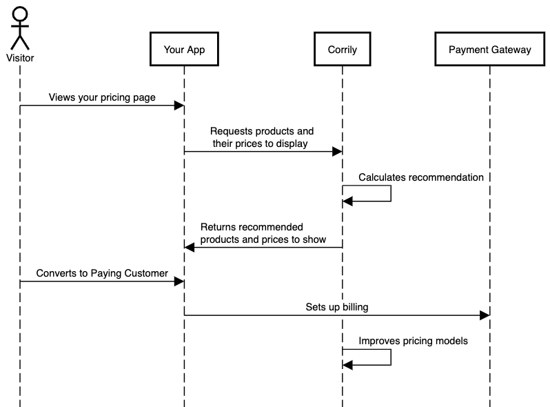

Most customers use **Corrily for end to end price management** i.e. all the way from managing master prices across all products
and countries, as well as serving experimental or personalized prices. Since Corrily is able to abstract the complexity of
managing multiple sets of prices, which can also change over time, this simplifies price management exponentially for our
customers. However, if your master list of prices are deeply integrated with other enterprise workflows, and you are looking
to utilize Corrily's price optimization capabilities while still managing the master set of prices on your own, you can
use us as a **Recommendation Engine**.

<h3> Corrily as a Recommendation engine</h3>

Running Corrily as a Recommendation Engine for your prices as well as products is really straightforward:

* Instead of integrating prices returned by Corrily on your pricing interface, you can call Corrily in parallel with your
regular pricing flow.

* You would still be calling Corrily's APIs every time a price needs to be fetched, and pass all the relevant information i.e.
`User IPs`, `User IDs`, `Product IDs`, `Country`, `Coupons` and any additional user characteristics such as device, acquisition
channel etc.

* Corrily's recommended price can now be stored as an ephemeral price and displayed based on certain business logic at your
end

* You would still be feeding revenue events to Corrily using pertinent integration options for you

Here is an illustration of how the end to end flow would look.

If you are using Corrily to optimize your paywall (i.e. optimizing which plans and products to display), you would still be
following the same set of steps.

