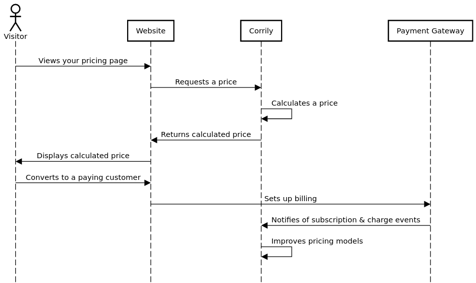

The diagram below summarizes Corrily's price optimization workflow. The list after the diagram provides more detail
about each step in the diagram.

{/*
  If you update the diagram, remember to update the following pages as well:

  - Pricing page integration guide
  - Payment gateway integration guide
*/}

{/*
Created with sequencediagram.org
Source text:
title How Corrily's price optimization works

actor Visitor
participant Website
participant Corrily
participant Payment Gateway

Visitor->Website:Views your pricing page
Website->Corrily:Requests a price
Corrily->Corrily:Calculates a price
Corrily->Website:Returns calculated price
Website->Visitor:Displays calculated price
Visitor->Website:Converts to a paying customer
Website->Payment Gateway:Sets up billing
Payment Gateway->Corrily:Notifies of subscription & charge events
Corrily->Corrily:Improves pricing models
*/}

- **Views your pricing page**. A visitor requests to see the pricing page for your product on your website (or app).
- **Requests a price**. Rather than displaying a hardcoded, static price for all visitors, you call Corrily's [calculate price](../api-reference/calculate-price) endpoint to calculate the price that should be presented to the visitor. Note that this endpoint also handles price localization. You provide the visitor's IP address so that Corrily can infer the visitor's location, which probably affects the optimal price for this visitor. You also provide any [user characteristics](..users/user-characteristics) which you think may affect the optimal price.
- **Calculates a price**. Corrily's AI models use the data that you provided to determine what price to present to this visitor. The calculated price is either an experimental price or a control price used to benchmark future prices. Note: In the Corrily dashboard you define the parameters of the experimental prices, such as the upper/lower bounds and the percentage of visitors who should see experimental prices.
- **Returns calculated price**. Corrily returns the price that you should present to the user in the response of your [calculate price](../api-reference/calculate-price) request.
- **Displays calculated price**. You render and display the pricing page with the price that Corrily provided.
- **Converts to a paying customer**. In this example, the visitor converts to a paying customer. If the visitor abandons your pricing page without converting, that is also a useful signal (more on that below).
- **Sets up billing**. You hand off the billing details to your payment gateway.
- **Notifies of subscription & charge**. Your payment gateway emits [webhook](https://en.wikipedia.org/wiki/Webhook) events over the entire customer lifecycle, such as when they sign up, when they pay their subscription fees, and when they cancel their subscription. The absence of webhook events implies that the original visitor abandoned without converting. In that case, Corrily infers that the price was too high.
- **Improves pricing models**. Corrily uses the webhook events (or absence of webhook events) as signals for determining optimal prices. A "new customer" event is a signal that the price was close to optimal. An "invoice paid" event is a further signal. 6 "invoice paid" events is even more of a strengthening signal. Many "subscription cancel" events in a short timeframe could be a signal that something has changed (e.g. a particular country is going through an economic recession) and therefore the optimal price is now probably lower.
