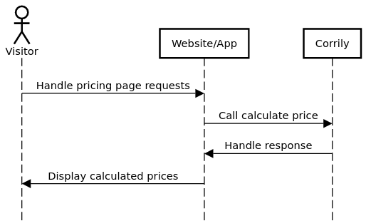

This page provides implementation guidance on how to use Corrily's API to calculate a price and display that price on
your website or app. In terms of the [Price optimization overview](./price-optimization-overview) diagram, this guide
covers steps 1 to 5 (**views your pricing page** to **displays calculated price**). See [Payment gateway integration guide](../payment-gateways/integration-guide) for guidance on steps 7 and 8 (**sets up billing** and **notifies of subscription & charge events**).

## Overview

The diagram below provides more implementation detail about the pricing page integration workflow. The sections after the diagram provide more explanation about each step.

{/*
Diagram generated with https://sequencediagram.org
Source text:
actor Visitor
participant Website/App
participant Corrily

Visitor->Website/App:Requests to view your pricing page
Website/App->Website/App:Creates a user ID for the visitor
Website/App->Website/App:Associates the visitor's IP address to their user ID
Website/App->Corrily:Calls the calculate price API
Corrily->Corrily:Calculates a price
Corrily->Website/App:Returns the calculated price
Website/App->Visitor:Render & display the pricing page with calculated price(s)
*/}

## Handle pricing page requests

A visitor wants to see how much your product/service costs. Previously, you may have returned a single, static page for all visitors. Now, you'll need to do a little more work in order to display a localized and possibly optimized price for each visitor.

## Call calculate price

Now it's time to call Corrily's [Calculate price](../api-reference/calculate-price) API to calculate a price for this particular visitor. See the [Calculate price](../api-reference/calculate-price) API reference page and the [Calculate price API examples](./calculate-price-api-examples) page for more information on using this API.

<Warning>

<h3>User IDs</h3>

If you're doing price experimentation, you'll need a stable user ID for each visitor of your pricing page. That's because Corrily requires you to associate each calculated price with a user ID so that later, when you manually or automatically notify Corrily of subscription or charge events, it can determine the outcome of each experimental price.

</Warning>

<Warning>
  
<h3>IP addresses</h3>

If you're using a server-centric architecture and want to provide localized currencies, you'll need to detect the visitor's IP address (unless you know the visitor's location by some other means). \nWhen detecting the IP address, make sure that you're actually getting the IP address of the client, not your reverse proxy, load balancer, etc. Check out [`X-Forwarded-For`](https://developer.mozilla.org/en-US/docs/Web/HTTP/Headers/X-Forwarded-For) as a solution.

</Warning>

## Handle response

Corrily returns a JSON object containing the price data. See [Calculate price response](../api-reference/calculate-price#response) for reference information about each field in the response.

## Display calculated prices

For a server-focused website/app architecture, you can render the calculated price into your pricing page before showing anything to your visitor. For a client-focused website/app architecture, you can display a placeholder or blank space while you wait for the calculated price data from Corrily.

## Next steps

- Read the [Payment gateway integration guide](../payment-gateways/integration-guide) to learn how to create new subscriptions/charges with custom prices and how to notify Corrily of subscription/charge events so that its AI can continuously improve the pricing of your products
- Browse the [Sample app source code](https://glitch.com/edit/#!/corrily?path=README.md%3A1%3A0) to see a working demonstration of the pricing page integration workflow
