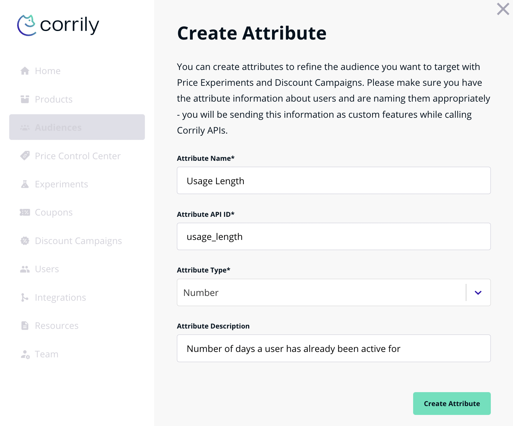

You can use Corrily Attributes to build the audiences that see your experiments or specific prices, or just analyze how well
your pricing and packaging strategy is working. Attributes can either be a *string*, a *number* or a *boolean*.
You can use the Attributes tab under Audiences to create and manage all your user attributes. When you create a new audience,
you can choose different matching functions depending on the Attribute format viz. comparison operations like
'greater than" or "equal to" for *number*, 'starts with' for *string* and "true/false" for *boolean*

<h3>To create a new attribute:</h3>

* Navigate to Audiences > Attributes
* Click Create Attribute.
* Enter a name, description and a key for the attribute. For example, an attribute to describe different kinds of users
on your platform might be called "User Type" (*string*), or an attribute to describe the length of the users on your platform
may be called "User Length" (*number*)

