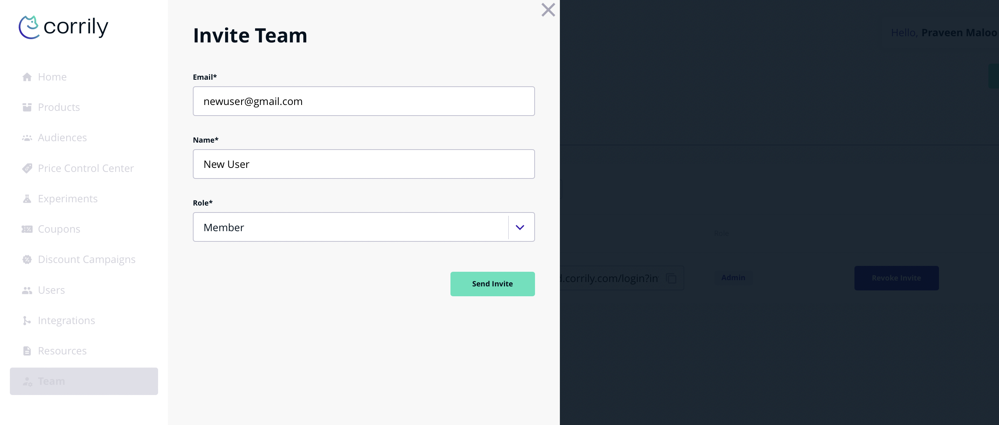

Corrily Admins can invite others users in their organization to the dashboard by following these steps:

* Navigate to the *Team* page on the dashboard
* Click on `Invite`. Enter user's email, name and the desired role
* Once invited, the user will receive an invitation email.
* They can then accept the invite and logon to the Corrily dashboard.description.description

You can check pending invites on the `Invited` tab on the Team Management Page. If a user hasn't accepted your invite, or
if you sent it to an incorrect email, you can revoke the invite from the same tab.

